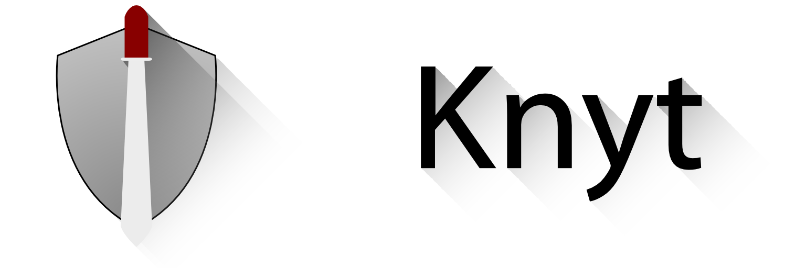

Knyt is a command line tool written in Objective-C that parses Objective-C files and validates that they conform to the [New York Times Objective-C style guide](https://github.com/NYTimes/objective-c-style-guide), reporting any errors that it finds.

##Current support

* Spaces are used for indentation instead of tabs
* The number of spaces used in indentation is a multiple of four
* Opening braces must be at the end of a line (Egyptian style)
* There is a space after the scope of an Objective-C method declaration
* Classes have a three letter prefix
* One line `if`, `else if`, `else`, `for`, `while` and `switch` statements aren't used
* `CGGeometry` functions are used in place of directly accessing size or origin of rectangles
* `NS_ENUM_` is used in place of `enum`
* Comparisons to `YES`, `NO` and `nil` don't happen
* Optional: Apache license in current form at the top of files

Knyt won't support checking for all of the rules described in the style guide, especially where it is difficult to identify failures (such as dot syntax being used or not used for something that is or isn't a property) or the rules aren't strict (such as the rules for ternery operators). Most of the checking is done with regular expressions.

##Usage

The most basic usage is `./knyt -dr /path/to/directory` to validate a directory of Objective-C files (searches for all .h and .m files). You can either build Knyt and use the executable or run from Xcode by editing the scheme. Flags:

* `-f` For a file (followed by its path)
* `-d` For a directory (followed by a directory path)
* `-dr` To recursively search a directory (followed by a directory path)
* You can also use the following to apply additional non-standard rules:
	* `-apache` Check files have the Apache license format in the same style as the Knyt source files (was written to validate this project!)

##Development

Knyt is currently in alpha. It is written according to the style guide that it is based off of!

##License
See the license file for the Apache 2.0 license.